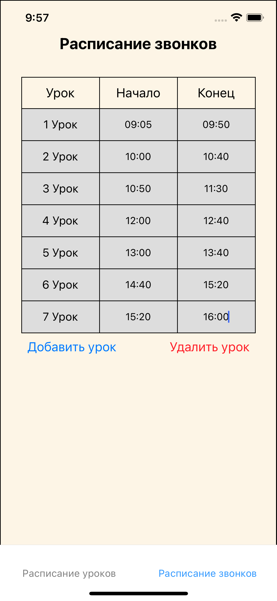

# Schedule-mobile-app
Mobile application for storing school schedule and managing homework. This project was done within final project exam in my school.

This app maintains two main goals:
- Lesson schedule & Homework managing
- Bells schedule 

## Lesson schedule & Homework managing
Supports several main commands:
- Add new lesson
- Delete lesson
- Change subject name
- Add homework or some notes
- Mark homework as completed

## Bells schedule

During covid-19 our school bells changed. This led to great confusion of students and teachers. I decided to add bells schedule as a separate tab in my app to check when lessons start.

Functionality
- Add new lesson
- Delete lesson
- Change start/end timing

## How does it look?

<table style="border: 0px;">
  <tr>
    <td>
      
    </td>
    <td>
      
    </td>
  </tr>
</table>
